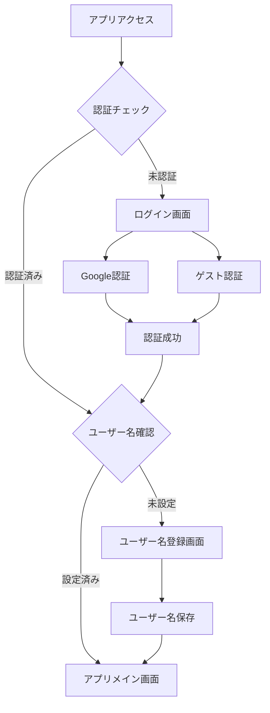

```mermaid
flowchart TD
    A[アプリアクセス] --> B{認証チェック}
    B -->|未認証| C[ログイン画面]
    B -->|認証済み| D{ユーザー名確認}
    
    C --> E[Google認証]
    C --> F[ゲスト認証]
    
    E --> G[認証成功]
    F --> G
    
    G --> D
    
    D -->|未設定| I[ユーザー名登録画面]
    D -->|設定済み| J[アプリメイン画面]
    
    I --> K[ユーザー名保存]
    K --> J
```