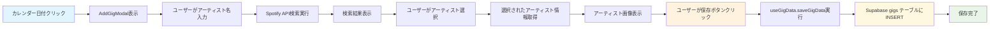

```mermaid
flowchart LR
    A[カレンダー日付クリック] --> B[AddGigModal表示]
    B --> C[ユーザーがアーティスト名入力]
    C --> D[Spotify API検索実行]
    D --> E[検索結果表示]
    
    E --> F[ユーザーがアーティスト選択]
    F --> G[選択されたアーティスト情報取得]
    G --> H[アーティスト画像表示]
    
    H --> I[ユーザーが保存ボタンクリック]
    I --> J[useGigData.saveGigData実行]
    J --> K[Supabase gigs テーブルにINSERT]
    K --> L[保存完了]
    
    style A fill:#e1f5fe
    style I fill:#fff3e0
    style K fill:#fff8e1
    style L fill:#e8f5e8
```